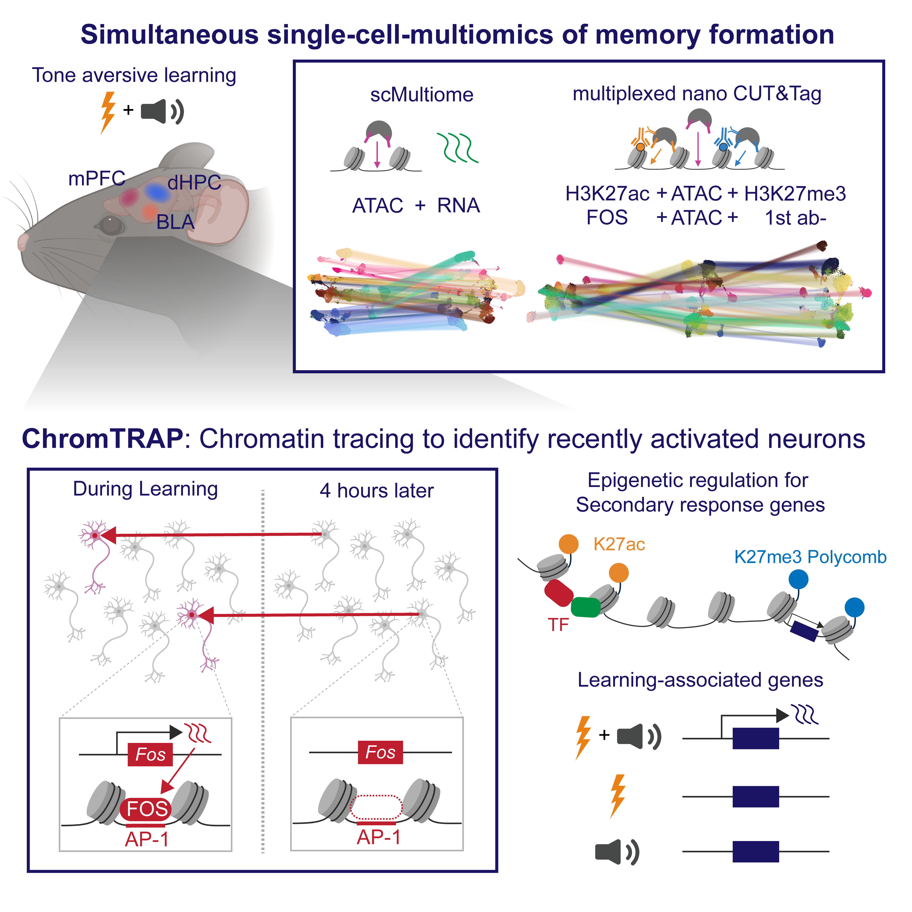

# Itoh_and_Khalil_2026

Code for [Single-cell chromatin tracing reveals multimodal molecular programs during memory formation](https://doi.org/10.64898/2026.06.16.732522)  
Authors: Kaho Itoh, Valentina Khalil, Isam Faress, and Taro Kitazawa   
Preprint: bioRxiv  

  

## Contents  
- `1_scMultiome`, `2_multi-nanoCT`, and `3_Smart-seq2`: Preprocessing and downstream analysis for each dataset.
- demo_ChromTRAP: a minimal demo for the ChromTRAP analysis.

## Notes
This repository provides the custom analysis scripts and representative command templates used in the study. Standard preprocessing steps are described in the Methods section of the manuscript.  
Some local/HPC-specific wrapper scripts are provided as templates and may require path and parameter updates before reuse.